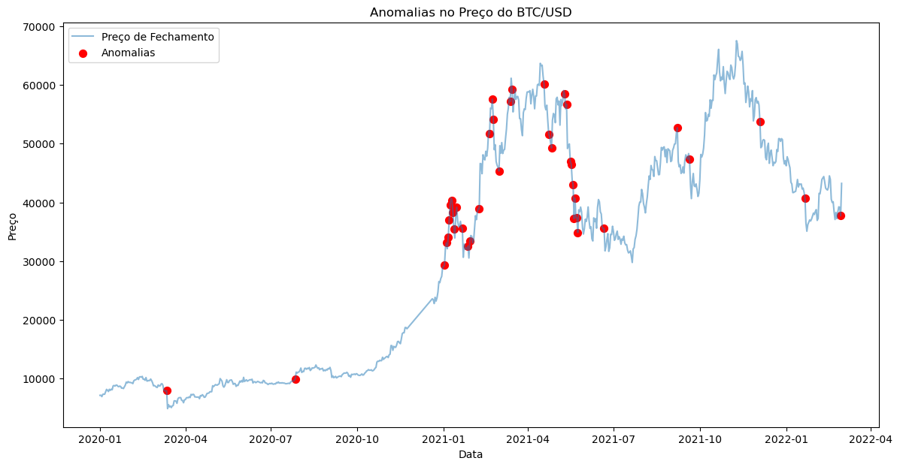

# 📊 **Análise de Padrões e Anomalias no Mercado de Criptomoedas**

Este projeto explora o comportamento do Bitcoin (BTC/USD) usando técnicas avançadas de ciência de dados, séries temporais e aprendizado de máquina. O objetivo é identificar padrões sazonais, clusters comportamentais e anomalias no mercado de criptomoedas.

---

## 🎯 **Objetivo**

O projeto visa:
- Analisar o comportamento diário do BTC/USD.
- Identificar padrões sazonais e tendências.
- Detectar anomalias e eventos extremos.
- Agrupar dias similares com base em características como retorno, volatilidade e volume.

Essa análise pode ser usada para:
- Desenvolver estratégias de trading.
- Gerenciar riscos em períodos de alta volatilidade.
- Prever movimentos futuros no mercado.

---

## 🛠️ **Metodologia**

### 1. **Preparação dos Dados**
- **Fonte dos Dados:** Candles de 1 minuto agregados para criar candles diários.
- **Features Calculadas:**
  - Retorno diário (`daily_return`).
  - Volatilidade (`high - low`).
  - Volume negociado (`volume_usd`).
  - Dia da semana numérico (`dia_da_semana_num`).

### 2. **Análise Exploratória**
- Decomposição da série temporal (tendência, sazonalidade, resíduos).
- Testes estatísticos:
  - ADF e KPSS: Verificar estacionariedade.
  - Ljung-Box: Autocorrelação.
  - Shapiro-Wilk e Jarque-Bera: Normalidade dos retornos.

### 3. **Modelagem**
- **Séries Temporais:**
  - SARIMA: Modelar tendências e sazonalidade.
  - GARCH: Capturar volatilidade.
  - Prophet: Prever preços futuros.
- **Clusterização:**
  - K-Means: Agrupar dias similares.
- **Detecção de Anomalias:**
  - Isolation Forest: Identificar eventos incomuns.

### 4. **Visualizações**
- Gráficos interativos com Matplotlib e Plotly.
- Decomposição da série temporal.
- Clusters e anomalias destacadas no tempo.

---

## 🔍 **Insights Principais**

### 1. **Padrões Sazonais**
- Maior volatilidade e volume nos finais de semana.
- Tendência de alta nas sextas-feiras e quedas nas segundas-feiras.

### 2. **Clusters Comportamentais**
Os dias foram divididos em três grupos:
- **Cluster 1:** Dias de alta volatilidade e grandes movimentos positivos.
- **Cluster 2:** Dias estáveis com baixa atividade.
- **Cluster 3:** Pequenas quedas com moderada volatilidade.

### 3. **Anomalias Detectadas**
- Foram identificados 39 dias classificados como anomalias.
- Muitos desses eventos estão associados a:
  - Crash de março de 2020 (COVID-19).
  - Regulamentações ou hacks no mercado.

---

## 📊 **Visualizações**

### 1. Decomposição da Série Temporal

### 2. Clusters no Tempo

### 3. Anomalias Detectadas

